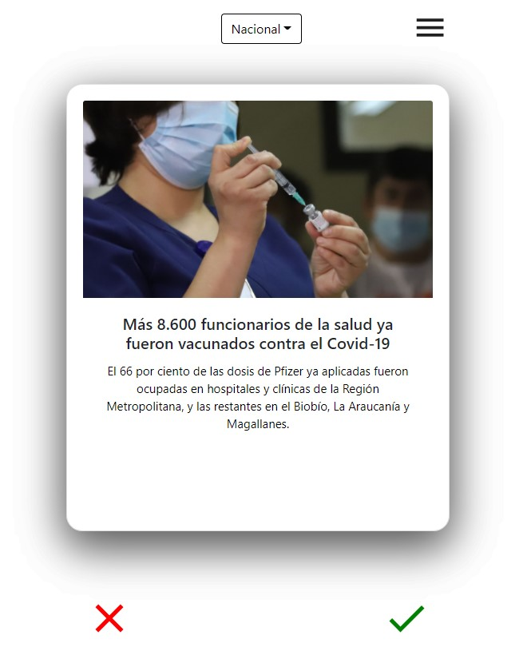
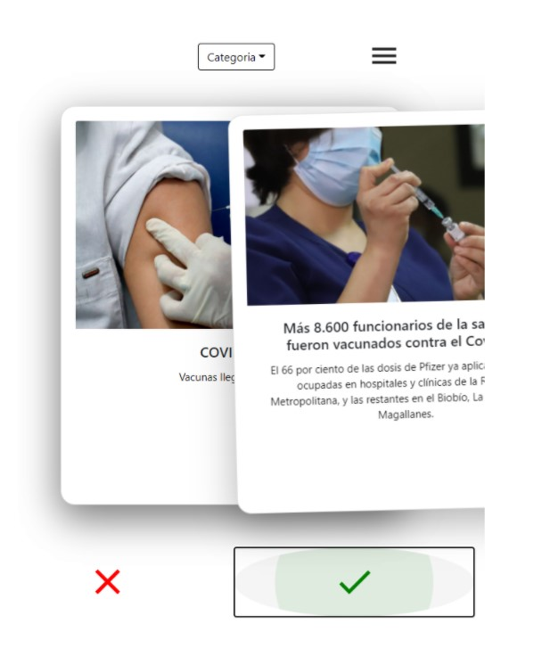
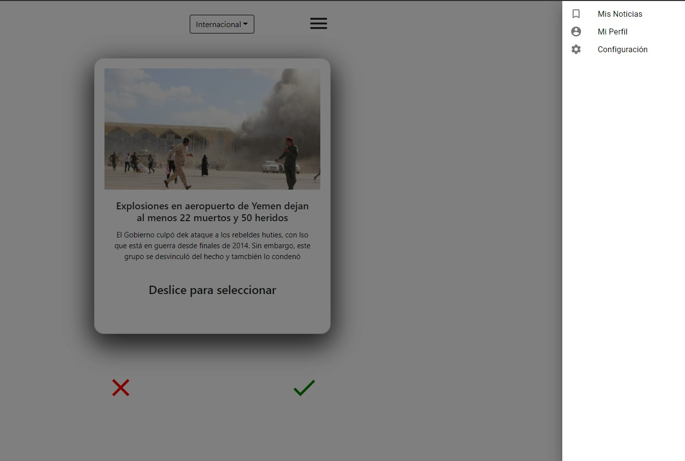

# Diseño de Interfaces Usuarias - 2020-2 - TinderNews

1. [Contexto](#context)
2. [Stack de tecnologías](#stack)
3. [Instrucciones de ejecución](#comand)
4. [Screenshots del proyecto](#ss)
5. [Link al demo](#demo)
6. [Integrantes](#contact)

<a name="context"></a>
## 1. Contexto
En este repositorio se aloja el código del proyecto realizado para el ramo Diseño de Interfaces Usuarias (INF-322), el cual consiste en una aplicación de visualización y guardado de noticias al estilo Tinder, en donde el usuario, según la categoría que escoja, se le mostrarán noticias y éste podrá elegir guardarlas o no guardarlas.

<a name="stack"></a>
## 2. Stack de tecnologías
- Node.js
- ReactJS
- Bootstrap 4
- Material UI
- Heroku

<a name="comand"></a>
## 3. Instrucciones de ejecución
Primero, se debe clonar el repositorio. Se puede descargar directo desde el mismo repositorio o utilizando la terminal con el siguiente comando
```git
git clone https://github.com/luciofondon98/Diseno-de-Interfaces-2020-2.git
```
Luego, ejecutar los dos comandos a continuación:
```node
npm install
npm start
```
<a name="ss"></a>
## 4. Screenshots del proyecto





<a name="demo"></a>
## 5. Link al demo
https://tinder-news-diu.herokuapp.com/

<a name="contact"></a>
## 6. Integrantes:
- Rodrigo Cayazaya: rodrigo.cayazaya@sansano.usm.cl
- Lucio Fondón: lucio.fondon@sansano.usm.cl
- Francisco Reyes: francisco.reyesja@sansano.usm.cl
